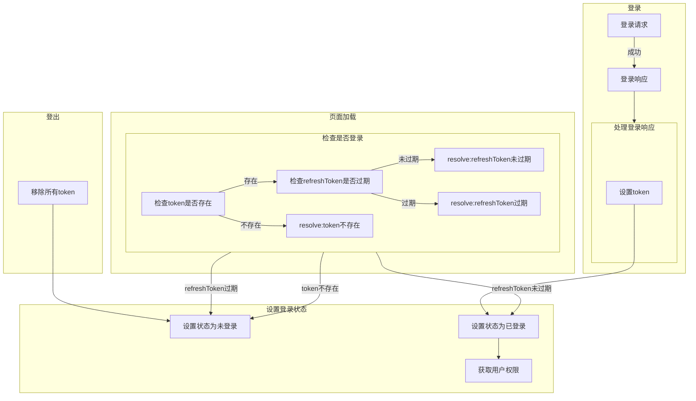
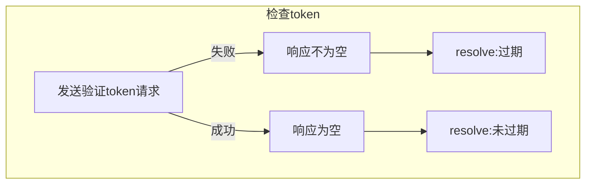

# 登录系统的示意图
~~应该写成数据流图才对~~

# 设计思路
使用token维护用户的登录状态，
- 前端
  用vue的导航守卫来控制用户对页面的访问，避免用户访问没有权限的页面
  但是前端是不可靠的，导航守卫可能被绕过，仅作为一种优化用户体验的手段
- 后端
  - 权限系统：RABC
    django自带的auth和permission,用户，用户组，权限彼此松耦合
  - token的解析与生成
    simpleJwt提供了默认的登录，验证，刷新模块，注册模块需要针对项目特点自行设计
  - DRF
    通过DRF的api_view,permission_classes来控制视图(views)
## 双token
双token是指每次登录会在用户端存储两个token，分别是
- access_token
  用于获取数据，存活时间较短
- refresh_token
  用于刷新access_token，存活时间较长
## 用户模型设计
- 游客
  只有看文章的权利
- 用户
  有评论的权利，后端的用户组为$NormalUserGroup$
- 管理员
  具有更多的权利，但是不是超级管理员，~~不打算为超级管理员设计ui操作页面，用IDE和python脚本就完事了~~
  后端的用户组为$NormalAdminGroup$
## axios
所有的ajax请求发送均使用axios库设计了两个axios实例，分别是

- guestApi
  面向游客，请求不会附带access_token，用于
  - 一切不需要权限的页面的数据的请求
  - token的验证，刷新(此时access_token可能失效)
- userApi
  一切需要权限的场合