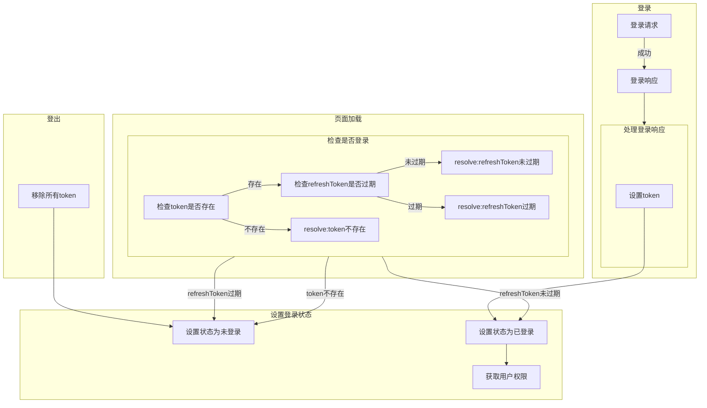
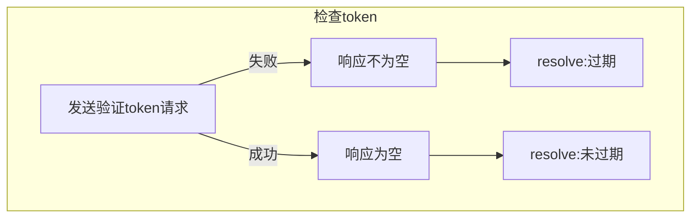

所有涉及请求的函数必须返回一个Promise

所有涉及路由的函数必须返回一个Promise

axios实例分为2个

- guestApi: 不需要token的请求
- userApi: 需要token的请求

请求规定

api下有针对博文的请求,针对迷宫的请求

method

- update 更新
- delete 删除
- create 创建
- list 获取列表(不包含逻辑删除) 分页
- get 获取具体某个
- recycle 获取回收站列表(只有逻辑删除)
- destroy 彻底删除

- api: /api
    - /blog
        - /blog/list 博文列表，含分页 (blogOutline) (guest) (show)
        - /blog/list/:id 查看某篇博文的内容 (blogDetail) (guest) (show)
        - /blog/recycle 回收站博文列表，含分页 (blogOutline) (admin) (show)
        - /blog/delete/:id 逻辑删除具体某篇博文 (managePage) (admin) (middleware)
        - /blog/destroy/:id 物理删除具体某篇博文 (managePage) (admin) (middleware)
        - /blog/update/:id 更新具体某篇博文 (managePage) (admin) (middleware)
        - /blog/create/ 博文的上传(文件) (managePage) (admin) (middleware)
    - /maze
        - /maze/create
    - /comment
        - /comment/blog/:id (blogDetail) (guest) (show) 含分页
        - /comment/user/ (commentPage) (user) (show) 含分页
        - /comment/recycle/ (commentPage) (user) (show) 含分页
        - /comment/delete/:id (commentPage) (user) (show)
        - /comment/destroy/:id (commentPage) (user) (show)
        - /comment/update/:id (commentPage) (user) (show)
        - /comment/create/ (blogDetail) (guest) (show) 暂不支持图片
    - /user
        - /user/register 注册
        - /user/login 登录
        - /user/refresh 刷新access_token
        - /user/verify 验证access_token和refresh_token
        - /user/permission 检查用户权限
        - /user/updatePassword 修改密码
        - _/user/updateInfo 修改用户信息
        - /user/list 获取用户列表 含分页
        - /user/update/:id 更新用户
        - /user/recycle 获取回收站用户列表 含分页
        - /user/delete/:id 逻辑删除用户
        - /user/destroy/:id 彻底删除用户
    - /friend (后台)
        - /friend/create/ (managePage) (admin) (middleware)
        - /friend/delete/:id (managePage) (admin) (middleware)
        - /friend/update/:id (managePage) (admin) (middleware)
        - /friend/list/ 前台获取列表
    - /tag
        - /tag/create/ (managePage) (admin) (middleware)
        - /tag/delete/:id (managePage) (admin) (middleware)
        - /tag/update/:id (managePage) (admin) (middleware)
        - /tag/list/ 前台获取列表

