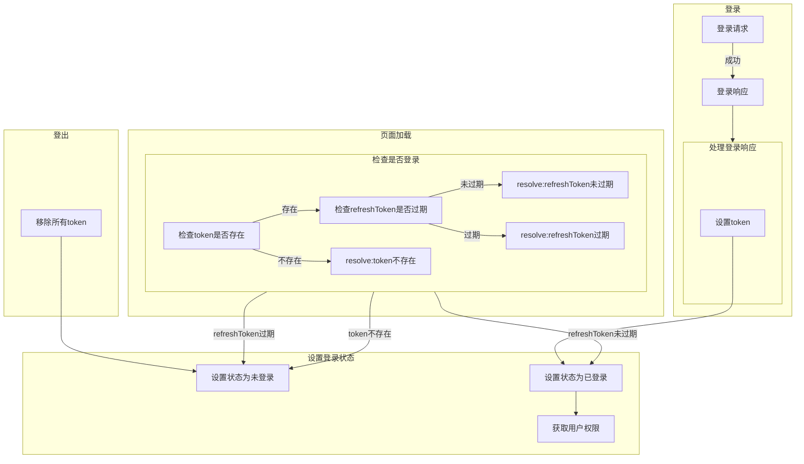
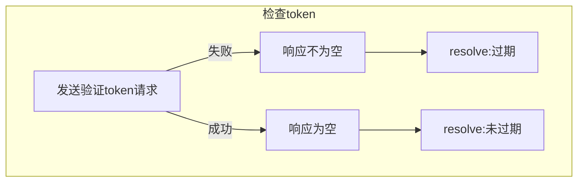

所有涉及请求的函数必须返回一个Promise

所有涉及路由的函数必须返回一个Promise

axios实例分为2个

- guestApi: 不需要token的请求
- userApi: 需要token的请求

请求规定

api下有针对博文的请求,针对迷宫的请求

- api: /api
  - /api/blog 需要权限: 博文的修改,删除,发布
    - /api/blog/rest/ 博文基本的增删改查使用restful
    - /api/blog/rest/:id
    - /api/blog/upload/ 博文的上传
  - /api/maze
  - /api/comment 需要权限: 评论的修改,删除,发布
    - /api/comment/rest/ 评论基本的增删改查使用restful
  - /api/token

