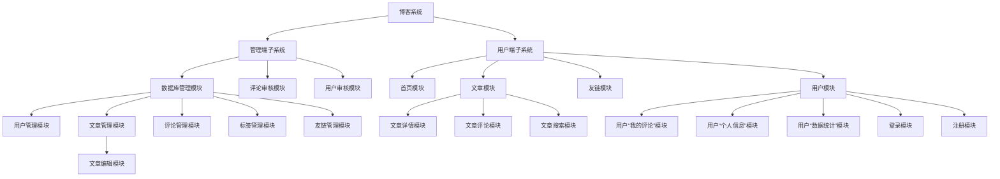

# 模块设计

## 用户端子系统

### 首页模块

TODO:

- [ ] 布局设计
- [ ] 美化设计
- [ ] 顶栏设计
- [ ] 备案信息设计

### 文章模块

#### 文章详情模块

TODO:

- [ ] 布局设计
- [ ] 接口设计

#### 文章评论模块

TODO:

- [ ] 布局设计
- [ ] 接口设计

#### 文章搜索模块

TODO:

- [ ] 布局设计
- [ ] 接口设计

### 友链模块

- [ ] 布局设计
- [ ] 接口设计

### 用户模块

#### 用户“我的评论”模块

- [ ] 布局设计
- [ ] 接口设计
- [ ] 评论删除
- [ ] 评论修改
- [ ] 评论展示

#### 用户“个人信息”模块

- [ ] 布局设计
- [ ] 接口设计
- [ ] 个人信息展示
- [ ] 个人信息修改
- [ ] 修改密码

#### 用户“数据统计”模块

- [ ] 布局设计
- [ ] 接口设计
- [ ] 数据统计展示

#### 登录模块

- [ ] 布局设计
- [ ] 接口设计
- [ ] 双token

#### 注册模块

- [ ] 布局设计
- [ ] 接口设计
- [ ] 字段校验

## 管理端子系统

### 数据库管理模块

#### 用户管理模块

- [ ] 删除用户
- [ ] 用户表格的展示（分页）

#### 文章管理模块

- [ ] 新增文章（上传markdown文件）
- [ ] 删除文章
- [ ] 修改文章
- [ ] 文章表格的展示（分页）

##### 文章编辑模块

- [ ] markdown编辑器
- [ ] markdown预览
- [ ] markdown上传和图片上传

#### 评论管理模块

- [ ] 评论表格的展示（分页）
- [ ] 删除评论

#### 标签管理模块

- [ ] 新增标签
- [ ] 删除标签
- [ ] 修改标签
- [ ] 标签表格的展示（分页）

#### 友链管理模块

- [ ] 新增友链
- [ ] 删除友链
- [ ] 修改友链
- [ ] 友链表格的展示（分页）

### 评论审核模块

- [ ] 工单（TODO)

### 用户审核模块

- [ ] 工单（TODO)

