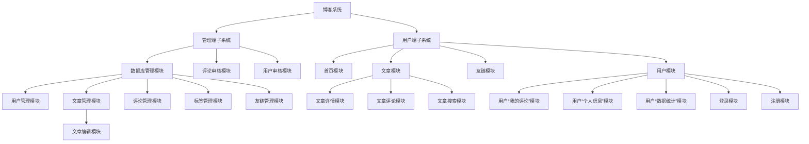

# 模块设计

## 用户端子系统

### 首页模块

TODO:

- [ ] 布局设计
- [ ] 美化设计
- [ ] 顶栏设计
- [ ] 备案信息设计

### 文章模块

#### 文章详情模块

TODO:

- [ ] 布局设计
- [ ] 接口设计
-

#### 文章评论模块

#### 文章搜索模块

### 友链模块

### 用户模块

## 管理端子系统

### 数据库管理模块

#### 用户管理模块

#### 文章管理模块

##### 文章编辑模块

#### 评论管理模块

#### 标签管理模块

#### 友链管理模块

### 评论审核模块

### 用户审核模块
